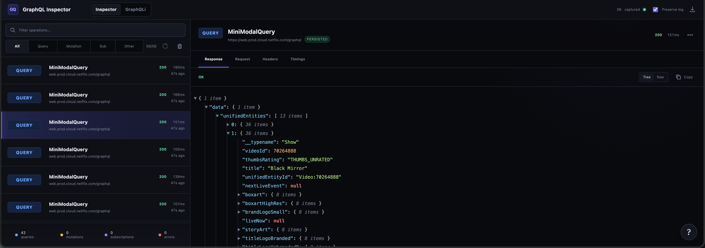
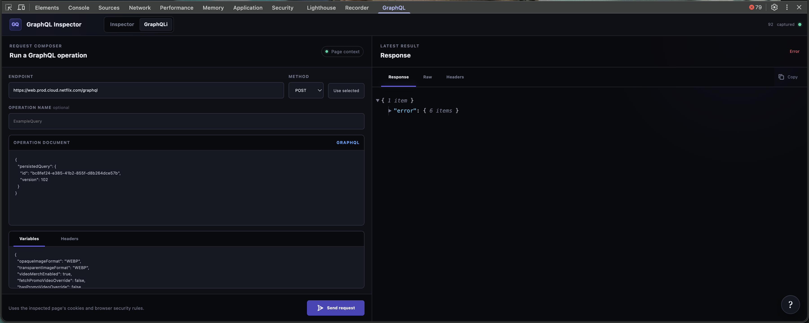

# GraphQL Inspector

Inspect GraphQL requests and responses without leaving Chrome DevTools.

GraphQL Inspector helps developers understand and debug the GraphQL traffic generated by a website. Capture runs while its DevTools panel is open by default, with an optional background mode for retaining earlier traffic. It works with queries, mutations, subscriptions, batched requests and persisted queries.

It also includes **GraphQLi**, a small client for editing and sending GET or POST operations from the inspected page.


## What it does

- Find and filter GraphQL queries, mutations and subscriptions.
- Inspect formatted queries, variables, responses, headers and events.
- Split batched operations and show persisted-query details.
- Follow WebSocket and EventSource subscription messages.
- Search requests or show only responses with GraphQL errors.
- Copy requests as cURL, `fetch` or JSON.
- Edit and send operations with GraphQLi.

## How to use it

1. Open the website you want to inspect.
2. Open Chrome DevTools.
3. Select the **GraphQL** tab.
4. Reload the page if no requests appear.

To retain bounded GraphQL traffic before DevTools opens, select the extension toolbar icon and enable **Background capture**. This preference applies to every open tab and uses additional page and extension memory, so it is disabled by default.



Select a request to view its query, variables, response, headers and timeline. Exports and copied commands remove credential headers by default; exporting credentials requires confirmation.



Use **GraphQLi** to edit and resend a captured request or write one from scratch. Requests include credentials available to the inspected page and remain subject to its origin and CORS rules.

## Install

[Install GraphQL Inspector from the Chrome Web Store](https://chromewebstore.google.com/detail/graphql-inspector/diokgfkmhochccjmgkhpmmjgimeofchp).

For local development, open `chrome://extensions`, enable **Developer mode**, then select **Load unpacked** and choose this repository. Refresh any page that was already open.

## Privacy

While the GraphQL DevTools panel is connected, GraphQL Inspector processes endpoints, request and response headers and bodies, and subscription events from the inspected tab. If **Background capture** is enabled, this processing also occurs in open tabs before their DevTools panels connect. This data can contain website content, personally identifiable information, personal communications, financial details or authentication credentials, depending on the inspected application.

Captured traffic remains temporarily in extension memory. On-demand traffic is cleared when the panel is cleared, DevTools closes or the inspected tab closes. Background traffic uses Chrome's memory-backed session storage so it can survive service-worker suspension; it is cleared when the setting is disabled, the tab closes, Chrome restarts or the extension reloads. Only the **Preserve log** and **Background capture** preferences are stored in Chrome's persistent local extension storage until they are changed or the extension is uninstalled. Exports are user initiated; default exports remove recognised credential headers, while including them requires confirmation.

GraphQLi sends a request only when **Send request** is selected, from the inspected page to the chosen endpoint. Captured data is not sent to the developer, analytics services or other parties. Access to all sites and network requests is required to detect GraphQL traffic in the inspected tab and, when explicitly enabled, in background tabs. The extension has no accounts, analytics, advertising, remote code or external services.

Information received through Chrome APIs is used only for GraphQL Inspector's stated purpose and in accordance with the Chrome Web Store User Data Policy, including the Limited Use requirements. The privacy policy was last updated on 27 July 2026. [Contact the developer](https://nicholasgriffin.dev/contact) with privacy questions.

## Development

No build step or runtime dependencies are required. Run the tests with Node.js 20 or later:

```bash
npm test
```

Package the extension with:

```bash
npm run package
```

## Licence

MIT. See `LICENSE`.
